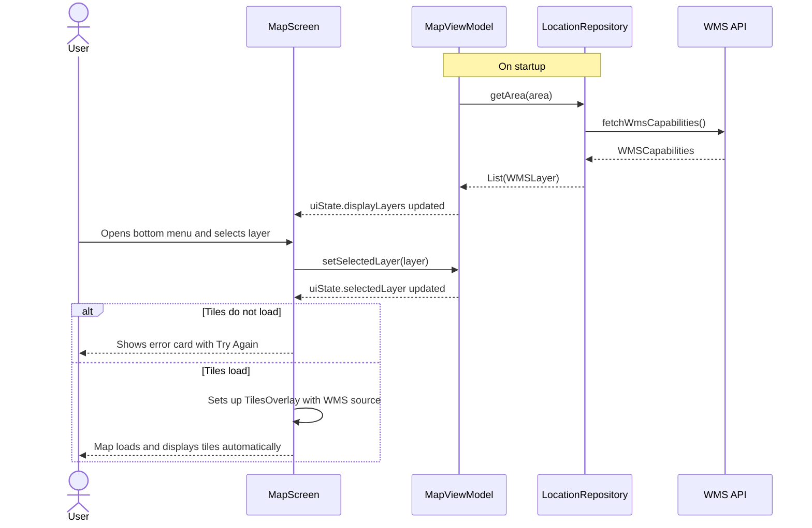
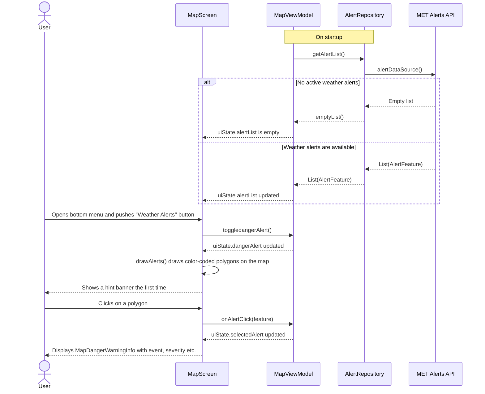

## Use cases

## Sequence diagram
### Sequence diagram 1: User changes weather overlay

```mermaid
sequenceDiagram
    actor User
    participant UI as MapScreen
    participant VM as MapViewModel
    participant Repo as LocationRepository
    participant WMS as WMS API

    Note over VM, Repo: On startup
    VM->>Repo: getArea(area)
    Repo->>WMS: fetchWmsCapabilities()
    WMS-->>Repo: WMSCapabilities
    Repo-->>VM: List(WMSLayer)
    VM-->>UI: uiState.displayLayers updated

    User->>UI: Opens bottom menu and selects layer
    UI->>VM: setSelectedLayer(layer)
    VM-->>UI: uiState.selectedLayer updated

    alt Tiles do not load
        UI-->>User: Shows error card with Try Again
    else Tiles load
        UI->>UI: Sets up TilesOverlay with WMS source
        UI-->>User: Map loads and displays tiles automatically
    end
```

### Sequence diagram 2: User views weather alerts

```mermaid
sequenceDiagram
    actor User
    participant UI as MapScreen
    participant VM as MapViewModel
    participant Repo as AlertRepository
    participant API as MET Alerts API

    Note over VM, Repo: On startup
    VM->>Repo: getAlertList()
    Repo->>API: alertDataSource()

    alt No active weather alerts
        API-->>Repo: Empty list
        Repo-->>VM: emptyList()
        VM-->>UI: uiState.alertList is empty
    else Weather alerts are available
        API-->>Repo: List(AlertFeature)
        Repo-->>VM: List(AlertFeature)
        VM-->>UI: uiState.alertList updated
    end

    User->>UI: Opens bottom menu and pushes "Weather Alerts" button
    UI->>VM: toggledangerAlert()
    VM-->>UI: uiState.dangerAlert updated
    UI->>UI: drawAlerts() draws color-coded polygons on the map
    UI-->>User: Shows a hint banner the first time

    User->>UI: Clicks on a polygon
    UI->>VM: onAlertClick(feature)
    VM-->>UI: uiState.selectedAlert updated
    UI-->>User: Displays MapDangerWarningInfo with event, severity etc.
```
