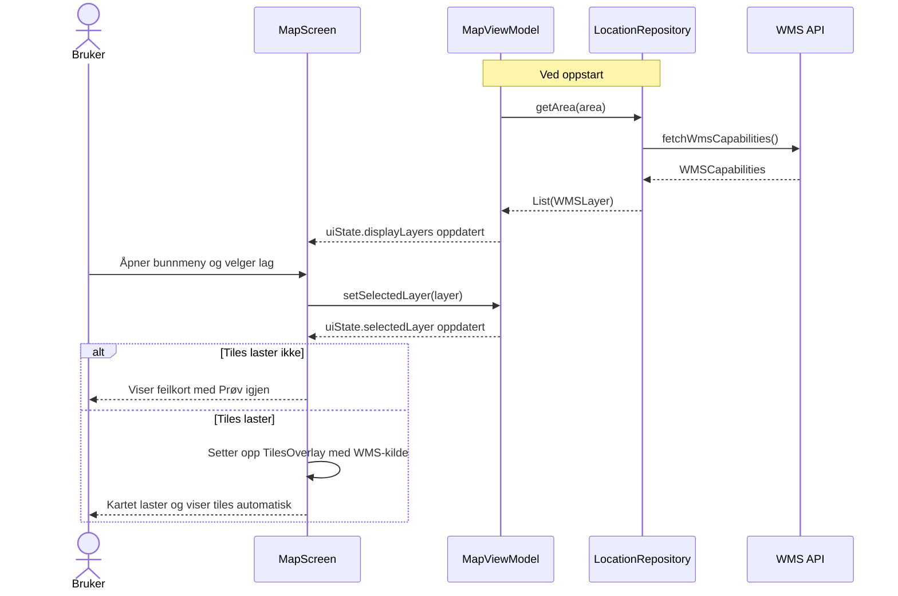

```mermaid
sequenceDiagram
    actor Bruker
    participant UI as MapScreen
    participant VM as MapViewModel
    participant Repo as LocationRepository
    participant WMS as WMS API

    Note over VM, Repo: Ved oppstart
    VM->>Repo: getArea(area)
    Repo->>WMS: fetchWmsCapabilities()
    WMS-->>Repo: WMSCapabilities
    Repo-->>VM: List(WMSLayer)
    VM-->>UI: uiState.displayLayers oppdatert

    Bruker->>UI: Åpner bunnmeny og velger lag
    UI->>VM: setSelectedLayer(layer)
    VM-->>UI: uiState.selectedLayer oppdatert

    alt Tiles laster ikke
        UI-->>Bruker: Viser feilkort med Prøv igjen
    else Tiles laster
        UI->>UI: Setter opp TilesOverlay med WMS-kilde
        UI-->>Bruker: Kartet laster og viser tiles automatisk
    end
```