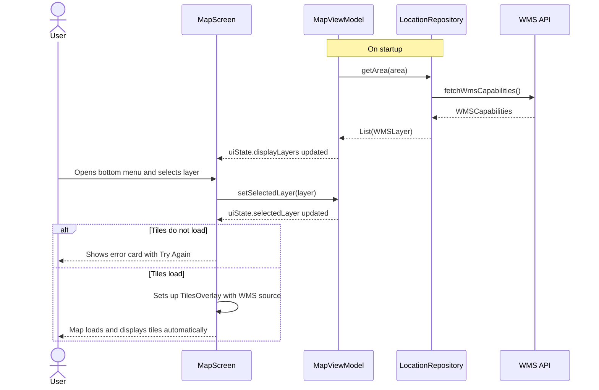
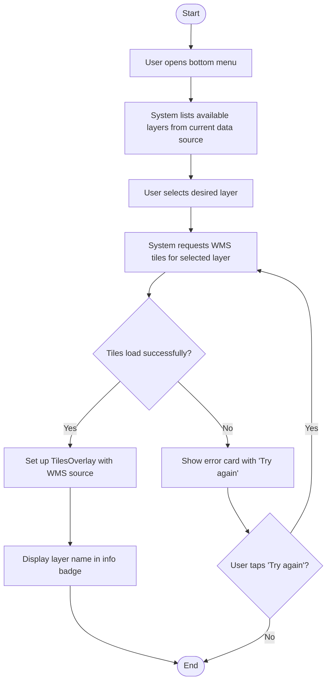
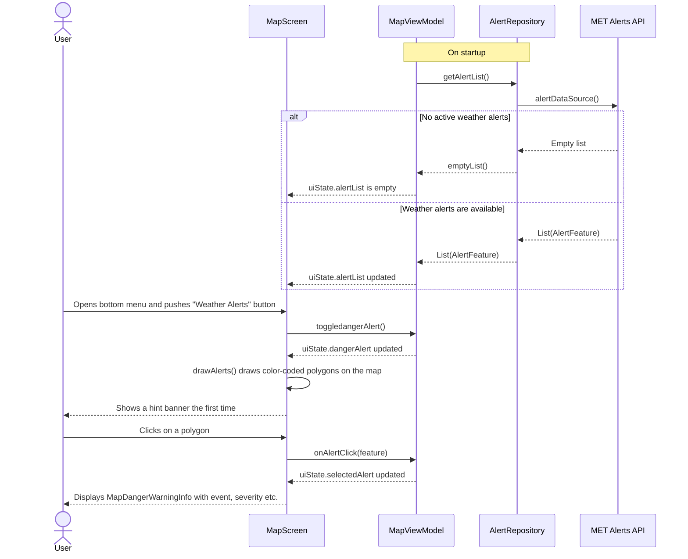
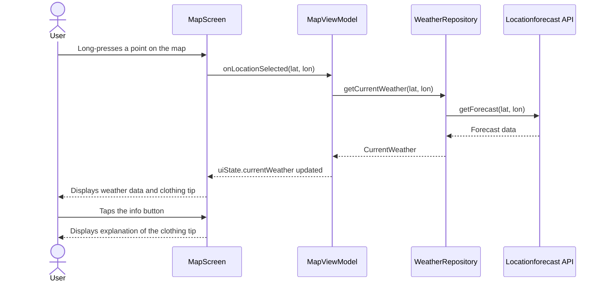
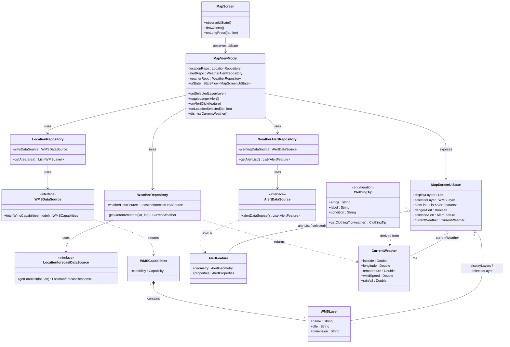

# Modelling

We have added three use case descriptions:
- Switch between weather layers
- Clothing tip based on weather conditions on a specific location
- Toggle weather alerts

We will show these as use textual desciptions, use case diagrams and sequence diagrams. Lastly we have included a class diagram.

## Functional requirements
The top-five functional requirements are listed in the table below:

| ID  | Requirement                            | Description                                                                                                                                                                                                  |
| --- | -------------------------------------- | ------------------------------------------------------------------------------------------------------------------------------------------------------------------------------------------------------------ |
| FR1 | Weather layers on the map              | The app let's the user toggle between temperature, precipitation and wind. The selected layer is rendered as WMS tiles overlay.                                                                              |
| FR2 | Weather alerts overlay and description | The system fetches active weather alerts and display them as polygons. Tapping a polygon opens details about the weather alert.                                                                              |
| FR3 | Weather and clothing tip on long-press | When the user taps on a specific point on the map, the system fetches current weather (temperature, wind speed, rainfall) and showcases it together with a clothing suggestion based on the weather values. |
| FR4 | Clothing tip explanation               | The system should be able to show an explanation to the user which weather condition (temperature range, rainfall, wind) triggered the displayed clothing tip.                                               |
| FR5 | Forecast layer navigation              | The system shall let the user step through the overlayforecast in time via a slider, and update the displayed layer to match the selected timestamp.                                                         |

## Use case 1: Visualise weather layers on the map
**Actor:** User

**Goal:** Visualize different weather data on the map (temperature, precipitation, wind)

**Precondition**: The map screen is open, theWMS data source is reachable and internet is connected

**Main flow:**
1. User opens the bottom menu
2. System lists available layers from the current data source
3. User selects the desired layer
4. System sets up a WMS overlay and displays the layer name in the info badge

**Alternative flow:**

4a. Tiles fail to load → system displays an error card with "Try again"

### Use case diagram

### Sequence diagram

### Activity diagram

## Use case 2: User views weather alerts
**Actor**: User

**Goal**: See active weather alerts as an overlay on the map

**Precondition**: The map screen is open

**Main flow:**
1. User opens the bottom menu and taps "Farevarsler"
2. System enables the alert overlay
3. System draws color-coded polygons on the map based on already fetched alerts
4. The first time the user enables alerts, a hint banner is displayed
5. User taps a polygon
6. System displays MapDangerWarningInfo with details about the alert

**Alternative flow:**

2a. No active alerts → no polygons are drawn

## Use case 3: User gets clothing suggestions
**Actor**: User

**Goal**: Get a clothing suggestion based on weather conditions at a selected location

**Precondition** The map screen is open, internet connected

**Main flow:**
1. User long-presses a point on the map
2. System fetches weather data for the selected point
3. System displays a dialog with temperature, precipitation and wind speed, along with a clothing tip based on the conditions
4. User taps the info button next to the clothing tip
5. System shows an explanation of which weather conditions triggered the tip

### Use case diagram

### Sequence diagram

## Class diagram

